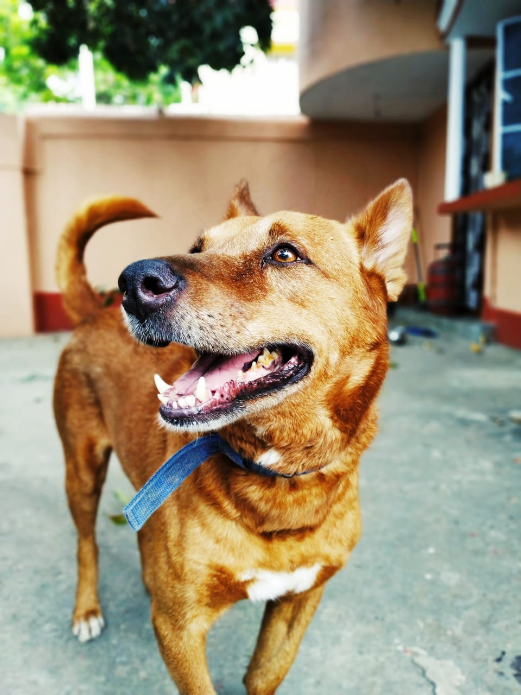
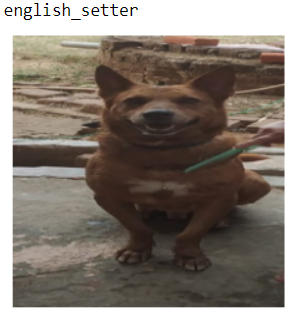
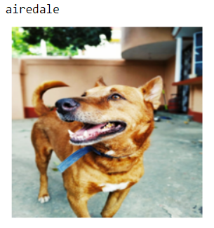

# <div align="center"> My dog breed identifier </div>

<div align="center">  </div>

## Problem statement

My dog name is **Sandy**. I don't know his breed. So, to find out his breed I have developed deep learning model 🤭.

## Result
| | |
|---|---|
| ||

<div align="center"> My 🐕 fooled my DL model with his smile 😠 </div>

## License

[](https://github.com/ashishcssom/Face_Mask_Detection_end_to_end_project/blob/master/LICENSE)
```
Copyright (c) 2020 Ashish Kumar
```

## Contact
[](https://www.linkedin.com/in/ashishk766/) 
[](mailto:ashish.krb7@gmail.com) 
